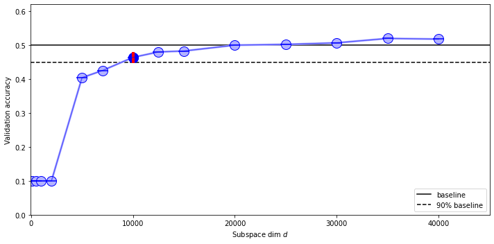

# Intrinsic-Dimension
Code implementing the paper "Measuring intrinsic dimension of objective landscapes".

I can reproduce, with minor variations, the overall results from the paper, in Pytorch, and extend the research to a different projection matrix. As part of this work, I have provided the results obtained from this implementation and almost all the references (and resurces that I find useful) utilized to complete it.

All the results follow the most similar implementation of the specific architecture shown in the paper. The projection used to obtain those results are the **Dense** and **Fastfood** ones following the same rule of the paper.

# MNIST Results

## Fully Connected
$Baseline$ | $Network$  | $D$  | $d_{int90}$  |
|:---|:---:|:---:|---:|
|Author Global| FC  | 199210  | 750  |
|Author Local | FC  | 199210  | ?  |
|Global| FC  | 199210  | 600  |
|Local | FC  | 199210  | 600  |
### Fully Connected - Global Baseline

### Fully Connected - Local Baseline

## LeNet 
$Baseline$ | $Network$  | $D$  | $d_{int90}$  |
|:---|:---:|:---:|---:|
|Author Global|LeNet|  44426  | 290 |
|Author Local |LeNet|  44426  | 275 |
|Global|LeNet|  44426  | 170 |
|Local |LeNet|  44426  | 170 |

### Lenet - Global Baseline

## LeNet - Local Baseline

## Untied LeNet
$Baseline$ | $Network$  | $D$  | $d_{int90}$  |
|:---|:---:|:---:|---:|
|Author Global| Untied LeNet  | 286334  | 600  |
|Author Local | Untied LeNet  | 286334  | 450  |
|Global| Untied LeNet  | 286334  | 350  |
|Local | Untied LeNet  | 286334  | 350  |

### Untied LeNet - Global Baseline

### Untied LeNet - Local Baseline

## FC LeNet
$Baseline$ | $Network$  | $D$  | $d_{int90}$  |
|:---|:---:|:---:|---:|
|Author Global| FC LeNet  |  3640574 | 2000  |
|Author Local | FC LeNet  | 3640574  | 1400  |
|Global| FC LeNet  | 3640574  | 900  |
|Local | FC LeNet  | 3640574  | 900  |

### FC LeNet - Global Baseline

### FC LeNet - Local Baseline

## FC Tied LeNet
$Baseline$ | $Network$  | $D$  | $d_{int90}$  |
|:---|:---:|:---:|---:|
|Author Global| FCTied LeNet  |  ? | 425  |
|Author Local | FCTied LeNet  |  ? | 400  |
|Global| FCTied LeNet  | 193370  | 400  |
|Local | FCTied LeNet  | 193370  | 400  |

### FC Tied LeNet - Global Baseline

### FC Tied LeNet - Local Baseline

# CIFAR10

## Fully Connected
$Baseline$ | $Network$  | $D$  | $d_{int90}$  |
|:---|:---:|:---:|---:|
|Author Global| FC  | 1055610  | 9000  |
|Author Local | FC  | 1055610  | 8000  |
|Global| FC  | 656810  | >12000  |
|Local | FC  | 656810  | 4000  |

### Fully Connected - Global Baseline
Unable to reproduce results for this case, possible problems of unnmatching dimension of the architecture.

### Fully Connected - Local Baseline

## LeNet
$Baseline$ | $Network$  | $D$  | $d_{int90}$  |
|:---|:---:|:---:|---:|
|Author Global|LeNet|  62006 | 1000 |
|Author Local |LeNet|  62006 | 2900 |
|Global|LeNet|  62006  | 2100 |
|Local |LeNet|  62006  | 1700 |

### LeNet - Global Baseline

### LeNet - Local Baseline

## Untied LeNet
$Baseline$ | $Network$  | $D$  | $d_{int90}$  |
|:---|:---:|:---:|---:|
|Author Global| Untied LeNet  |  658238 | 9000? 2750*  |
|Author Local | Untied LeNet  |  658238 | 15000 |
|Global| Untied LeNet  | 658238  | 40000  |
|Local | Untied LeNet  | 658238  | >40000  |

\* in the paper they claim a $d_{int90}$ of 2750 but in the plots from the implementation it seems to be 9000

### Untied LeNet - Global Baseline

### Untied LeNet - Local Baseline
Unable to reproduce results, because my local implementation performs better than the global baseline of the paper! 

## FC LeNet
$Baseline$ | $Network$  | $D$  | $d_{int90}$  |
|:---|:---:|:---:|---:|
|Author Global| FC LeNet  | 16397726  | 35000  |
|Author Local | FC LeNet  | 16397726  |  >100000 |
|Global| FC LeNet  | 16397726  | >70000  |
|Local | FC LeNet  | 16397726  | 27000  |

### FC LeNet - Gobal Baseline
Almost there...

### FC LeNet - Local Baseline

## FC Tied LeNet
$Baseline$ | $Network$  | $D$  | $d_{int90}$  |
|:---|:---:|:---:|---:|
|Author Global| FCTied LeNet  |  ? | 2500  |
|Author Local | FCTied LeNet  |  ? | 4500  |
|Global| FCTied LeNet  |  297734 | 12000  |
|Local | FCTied LeNet  |  297734 | 8000  |

### FC Tied LeNet - Global Baseline

### FC Tied LeNet - Local Baseline

## ResNet
$Baseline$ | $Network$  | $D$  | $d_{int90}$  |
|:---|:---:|:---:|---:|
|Author Global| ResNet  | 280000?  | 1000-2000  |
|Author Local | ResNet  | 280000?  | 20000-50000  |
|Global| ResNet  | 292954 | 1000  |
|Local | ResNet  | 292954 | 12000  |

### ResNet - Global Baseline
The implementation of this architecture is very hard to match so the results are very different from the paper!

### ResNet - Local Baseline

# Reference
1. https://www.uber.com/it/blog/intrinsic-dimension
2. https://tomroth.com.au/notes/intdim/intdim/
3. https://github.com/uber-research/intrinsic-dimension
4. https://twitter.com/JevGamper/status/1240335205807816705?s=20
5. https://github.com/jgamper/intrinsic-dimensionality
6. https://github.com/tnwei/intrinsic-dimension
7. https://greydanus.github.io/2017/10/30/subspace-nn/
8. https://discuss.pytorch.org/t/locally-connected-layers/26979/2
9. https://www.cs.princeton.edu/~runzhey/demo/Geo-Intrinsic-Dimension.pdf
10. https://github.com/LangLeon/thesis-intrinsic-dimension
11. https://towardsdatascience.com/interesting-projections-where-pca-fails-fe64ddca73e6
12. https://www.oreilly.com/library/view/hands-on-convolutional-neural/9781789130331/a33f17be-9d32-4499-aa1c-c1a81e023eb7.xhtml
13. https://cs231n.github.io/convolutional-networks/#convert
14. https://math.stackexchange.com/questions/995623/why-are-randomly-drawn-vectors-nearly-perpendicular-in-high-dimensions/995678
15. https://www.youtube.com/watch?v=Y_Ac6KiQ1t0&t=1s

