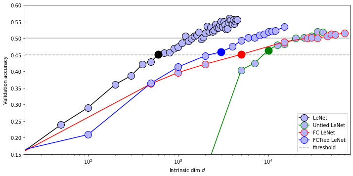
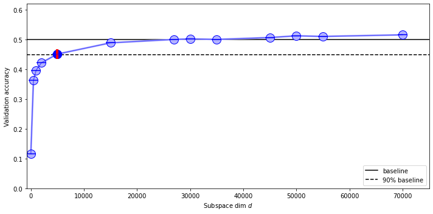

# Measuring the Intrinsic Dimension of Objective Landscapes
Code implementing the paper ["Measuring the Intrinsic Dimension of Objective Landscapes"](https://arxiv.org/pdf/1804.08838.pdf).

I can reproduce, with minor variations, the overall results from the paper, in Pytorch, and extend the research to a different projection matrix. As part of this work, I have provided the results obtained from this implementation and almost all the references (and resources that I find useful) utilized to complete it.

All the results follow the most similar implementation of the specific architecture shown in the paper. The projection used to obtain those results are the **Dense** and **Fastfood** ones following the same rule of the paper.

As you can see from the plots there is no mean or std for the measured data. This is first because the released code is provided with seed (I really hope reproducible) and second, because providing those data means running all the computations at least 3 times and the computations of some of these architectures are very time-consuming and with limited computing resources at my disposal this is the best I can do.

All plots below can be investigated further by the code in id_plots.ipynb.
All the training can be started in windows systems utilizing the *.ps1 or if you have a *nix system all the .ps1 can be easily translated to .sh as the one provided in the example.

# MNIST Results

## Fully Connected
$Baseline$ | $Network$  | $D$  | $d_{int90}$  |
|:---|:---:|:---:|---:|
|Author Global| FC  | 199210  | 750  |
|Author Local | FC  | 199210  | ?  |
|Global| FC  | 199210  | 600  |
|Local | FC  | 199210  | 525  |

### Fully Connected - Global Baseline

### Fully Connected - Local Baseline

## LeNet 
$Baseline$ | $Network$  | $D$  | $d_{int90}$  |
|:---|:---:|:---:|---:|
|Author Global|LeNet|  44426  | 290 |
|Author Local |LeNet|  44426  | 275 |
|Global|LeNet|  44426  | 170 |
|Local |LeNet|  44426  | 160 |

### Lenet - Global Baseline

### LeNet - Local Baseline

## Untied LeNet
$Baseline$ | $Network$  | $D$  | $d_{int90}$  |
|:---|:---:|:---:|---:|
|Author Global| Untied LeNet  | 286334  | 600  |
|Author Local | Untied LeNet  | 286334  | 450  |
|Global| Untied LeNet  | 286334  | 350  |
|Local | Untied LeNet  | 286334  | 350  |

### Untied LeNet - Global Baseline

### Untied LeNet - Local Baseline

## FC LeNet
$Baseline$ | $Network$  | $D$  | $d_{int90}$  |
|:---|:---:|:---:|---:|
|Author Global| FC LeNet  |  3640574 | 2000  |
|Author Local | FC LeNet  | 3640574  | 1400  |
|Global| FC LeNet  | 3640574  | 900  |
|Local | FC LeNet  | 3640574  | 800  |

### FC LeNet - Global Baseline

### FC LeNet - Local Baseline

## FC Tied LeNet
$Baseline$ | $Network$  | $D$  | $d_{int90}$  |
|:---|:---:|:---:|---:|
|Author Global| FCTied LeNet  |  ? | 425  |
|Author Local | FCTied LeNet  |  ? | 400  |
|Global| FCTied LeNet  | 193370  | 400  |
|Local | FCTied LeNet  | 193370  | 400  |

### FC Tied LeNet - Global Baseline

### FC Tied LeNet - Local Baseline

# CIFAR10 Results

## Fully Connected
$Baseline$ | $Network$  | $D$  | $d_{int90}$  |
|:---|:---:|:---:|---:|
|Author Global| FC  | 1055610  | 9000  |
|Author Local | FC  | 1055610  | 8000  |
|Global| FC  | 1051930  | 5000  |
|Local | FC  | 1051930  | 10000  |
|FastJL | FC  | 1051930  | 4000  |

### Fully Connected - Global Baseline
The results for this case are different due to problems of unnmatching dimension for the architecture (I tried various dimension and used the one that is more similar).

### Fully Connected - Local Baseline

### Fully Connected - FastJL

## LeNet
$Baseline$ | $Network$  | $D$  | $d_{int90}$  |
|:---|:---:|:---:|---:|
|Author Global|LeNet|  62006 | 1000 |
|Author Local |LeNet|  62006 | 2900 |
|Global|LeNet|  62006  | 600 |
|Local|LeNet|  62006  | 1700 |
|FastJL |LeNet|  62006  | 1250 |

### LeNet - Global Baseline

### LeNet - Local Baseline

### LeNet - FastJL

## Untied LeNet
$Baseline$ | $Network$  | $D$  | $d_{int90}$  |
|:---|:---:|:---:|---:|
|Author Global| Untied LeNet  |  658238 | 9000? 2750*  |
|Author Local | Untied LeNet  |  658238 | 15000 |
|Global| Untied LeNet  | 658238  | 10000  |
|Local | Untied LeNet  | 658238  | >40000  |
|FastJL | Untied LeNet  | 658238  | 2000  |

\* in the paper they claim a $d_{int90}$ of 2750 but in the plots from the implementation it seems to be 9000, very close to my implementation

### Untied LeNet - Global Baseline

### Untied LeNet - Local Baseline
Unable to reproduce results, because my local implementation performs better than the global baseline of the paper so the baseline is very skewed and the 90% baseline is very difficult to reach with few parameters! 

### Untied LeNet - FastJL

Little sparsification and variance problems after the drop in performance

## FC LeNet
$Baseline$ | $Network$  | $D$  | $d_{int90}$  |
|:---|:---:|:---:|---:|
|Author Global| FC LeNet  | 16397726  | 35000  |
|Author Local | FC LeNet  | 16397726  |  >100000 |
|Global| FC LeNet  | 16397726  | 5000  |
|Local | FC LeNet  | 16397726  | 27000  |
|FastJL | FC LeNet  | 16397726  | 5000  |

Here the results are very different!

### FC LeNet - Gobal Baseline

### FC LeNet - Local Baseline

### FC LeNet - FastJL

## FC Tied LeNet
$Baseline$ | $Network$  | $D$  | $d_{int90}$  |
|:---|:---:|:---:|---:|
|Author Global| FCTied LeNet  |  ? | 2500  |
|Author Local | FCTied LeNet  |  ? | 4500  |
|Global| FCTied LeNet  |  297734 | 3000  |
|Local | FCTied LeNet  |  297734 | 8000  |
|FastJL | FCTied LeNet  |  297734 | 2500  |

### FC Tied LeNet - Global Baseline

### FC Tied LeNet - Local Baseline

### FC Tied LeNet - FastJL
Here the results of FastJL are very unstable the architecture reach the intrinsic dimension and then drop, I think because the sparsification and the difference in parameter's variance here play an important role.

## ResNet
$Baseline$ | $Network$  | $D$  | $d_{int90}$  |
|:---|:---:|:---:|---:|
|Author Global| ResNet  | 280000?  | 1000-2000  |
|Author Local | ResNet  | 280000?  | 20000-50000  |
|Global| ResNet  | 292954 | 1000  |
|Local | ResNet  | 292954 | 12000  |
|FastJL | ResNet  | 292954 | 1000  |

The implementation of this architecture is very hard to match so the results are a bit different from the paper!

### ResNet - Global Baseline

### ResNet - Local Baseline

### ResNet - FastJL

# Reference
1. https://www.uber.com/en-IT/blog/intrinsic-dimension/
2. https://tomroth.com.au/notes/intdim/intdim/
3. https://github.com/uber-research/intrinsic-dimension
4. https://twitter.com/JevGamper/status/1240335205807816705?s=20
5. https://github.com/jgamper/intrinsic-dimensionality
6. https://github.com/tnwei/intrinsic-dimension
7. https://greydanus.github.io/2017/10/30/subspace-nn/
8. https://discuss.pytorch.org/t/locally-connected-layers/26979/2
9. https://www.cs.princeton.edu/~runzhey/demo/Geo-Intrinsic-Dimension.pdf
10. https://github.com/LangLeon/thesis-intrinsic-dimension
11. https://towardsdatascience.com/interesting-projections-where-pca-fails-fe64ddca73e6
12. https://www.oreilly.com/library/view/hands-on-convolutional-neural/9781789130331/a33f17be-9d32-4499-aa1c-c1a81e023eb7.xhtml
13. https://cs231n.github.io/convolutional-networks/#convert
14. https://math.stackexchange.com/questions/995623/why-are-randomly-drawn-vectors-nearly-perpendicular-in-high-dimensions/995678
15. https://www.youtube.com/watch?v=Y_Ac6KiQ1t0&t=1s
16. https://github.com/josuni/Intrinsic-Dimensionality-for-various-datasets
17. https://arxiv.org/pdf/1408.3060.pdf
18. https://johnthickstun.com/docs/fast_jlt.pdf
19. https://www.cs.technion.ac.il/~nailon/fjlt.pdf
20. https://arxiv.org/pdf/2204.01800.pdf
21. https://github.com/pytorch/pytorch/issues/88053

# Future works (time permitting)

- [ ] Using a beautiful projection like: https://arxiv.org/abs/1202.3033
- Try other datasets:
    - [x] FMNIST
    - [ ] EMNIST
    - [ ] FLOWERS102
    - [ ] ImageNet
- Try other architectures:
    - [ ] RNN
    - [ ] LSTM
    - [ ] Transformer
    - [ ] Inception
- [ ] Implementing RL tasks
- [ ] Evaluate performace with Regularization and Dropout